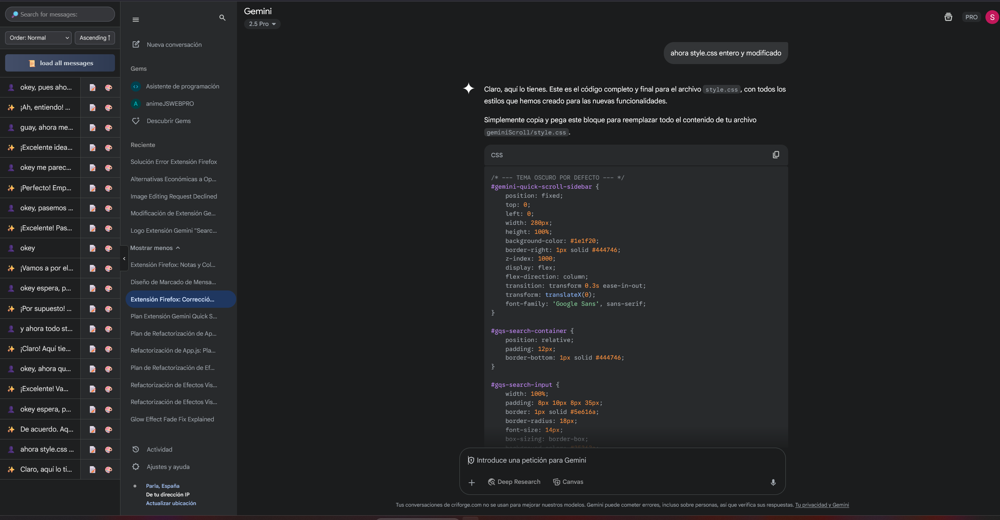
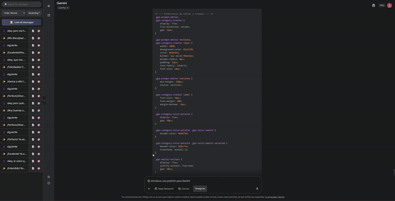

# Gemini Quick Scroll

Gemini Quick Scroll is a browser extension designed to enhance your experience on the Gemini website. It adds a smart and customizable sidebar that allows you to efficiently navigate, search, organize, and annotate long conversations.

watch the demo video here 👇👇👇 (click on the image)

---

## Main Features

* **Navigation Sidebar**: Access an index of your entire conversation. Click on any item to jump directly to that message.
* **Universal Prompt Library**: A powerful new feature to save, manage, and reuse your favorite prompts.
    * **Create & Manage Prompts**: Save your most used prompts for quick access in any chat.
    * **Category System**: Organize your prompts into custom categories with names and colors.
    * **Drag & Drop**: Easily reorder prompts by dragging and dropping them into the categories you want.
    * **Import & Export**: Share your prompt library with friends or back it up by exporting and importing it as a `.json` file.
* **Full History Load**: With a single click, the extension can automatically scroll to the top of the conversation to load all messages, ensuring nothing is left out.
* **Instant Search and Filtering**: Use the search bar to filter the message list in real-time and find exactly what you're looking for.
* **Message Sorting**: Organize the conversation view to your preference:
    * By chronological order (ascending or descending).
    * Grouped by type (user messages and Gemini responses).
* **Custom Notes**: Was a Gemini response particularly useful? Add a note directly in the sidebar to remember why it was important.
* **Color Highlighting**: Mark key messages with a color code to identify them visually at a glance.
* **Collapsible Interface**: The sidebar can be easily hidden and shown to not interfere with your workspace.

## Installation

This extension has been optimized for compatibility with all modern browsers, including Chrome, Firefox, Safari, Brave, Edge, Opera, and others. Choose the installation method for your browser:

### Chrome, Brave, Edge, Opera (Chromium-based browsers)

1.  Download or clone this repository to your computer. A simple way is to go to the [**Releases** page](https://github.com/salva-je/Gemini-charged/releases) and download the `.zip` file from the latest version.
2.  Unzip the downloaded file.
3.  Open your browser and go to the extensions page:
    * **Chrome**: `chrome://extensions`
    * **Brave**: `brave://extensions` (See [BRAVE-INSTALL.md](BRAVE-INSTALL.md) for detailed Brave-specific instructions)
    * **Edge**: `edge://extensions`
    * **Opera**: `opera://extensions`
4.  Enable "Developer Mode" (toggle in the top right).
5.  Click "Load unpacked" and select the folder where you unzipped the extension files.

### Firefox

1.  Download or clone this repository as described above.
2.  Open Firefox and go to `about:debugging`.
3.  Click "This Firefox" in the sidebar.
4.  Click "Load Temporary Add-on".
5.  Navigate to the extension folder and select the `manifest.json` file.

### Safari (macOS)

Installation on Safari is more complex and may require an Apple Developer account to sign the extension. For advanced users only.

## Usage

### Conversation History Sidebar

1.  **Activate the sidebar**: Once on the Gemini website, the sidebar will appear collapsed on the left. Click the `›` button to expand it.
2.  **Load messages**: If the conversation is very long, press the `Load all messages` button to load the full history.
3.  **Navigate**: Click on any item in the list to scroll to that message in the main window.
4.  **Add notes or colors**: Hover over an item in the list and you will see the `📝` (notes) and `🎨` (colors) icons. Click them to use their features.

### Prompt Library

1.  **Open the Library**: Next to the Gemini text input field, click the **"Prompt list"** button.
2.  **Create a Category**: Click "Add Category", give it a name and a color, and save.
3.  **Create a Prompt**: Click "Create New Prompt", write your prompt, and save. It will appear in the "Uncategorized" section by default.
4.  **Organize**: Simply click, hold, and drag a prompt from one category and drop it into another.
5.  **Use a Prompt**: Click on any prompt in the library, and it will be automatically inserted into the Gemini chat box, ready to be sent.

## Troubleshooting

**If the extension doesn't work in Brave:**
- Make sure Brave Shields are not blocking the extension
- Try disabling "Prevent sites from fingerprinting me" for gemini.google.com
- Check that JavaScript is enabled

**If the extension doesn't load:**
- Make sure you're using the correct manifest file for your browser
- For older browsers, try using `manifest-v2.json` instead of `manifest.json`
- Check the browser console for any error messages

**For browsers that don't support Manifest V3:**
- Rename `manifest-v2.json` to `manifest.json`
- This provides compatibility with older browser versions

## Contributing

Contributions are welcome. If you have ideas for improving the extension, please open an "issue" to discuss it or submit a "pull request" with your changes.
